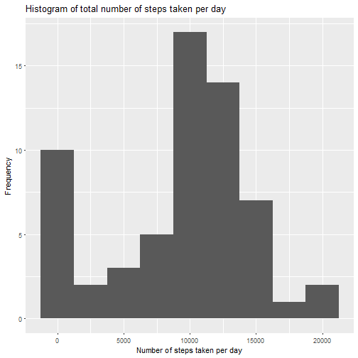
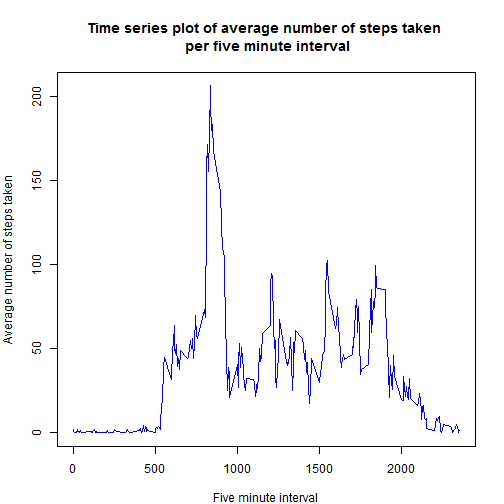
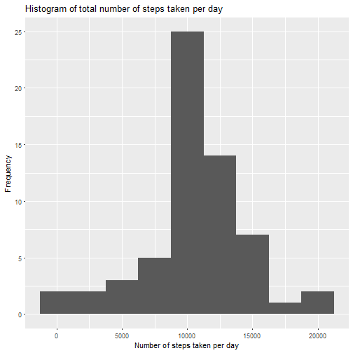
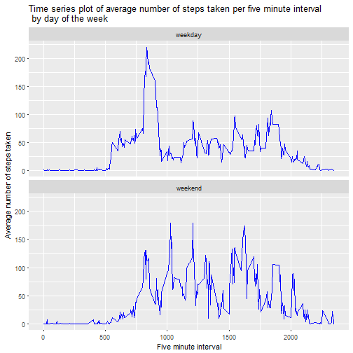

First Assignment: Reproducible Research
=====================================

###Loading and preprocessing the data


```r
library(lubridate)
library(dplyr)
library(ggplot2)
options(scipen = 9999)

#Reading the data and classifying date values as date
activity.monitoring <- read.csv("activity.csv", stringsAsFactors = FALSE)
activity.monitoring$date <- as_date(activity.monitoring$date)
```

###What is mean total number of steps taken per day?

```r
#Making a histogram of the total number of steps taken each day
steps.daily <- activity.monitoring %>% 
        group_by(date) %>% 
        summarise(total.steps = sum(steps, na.rm = T))

ggplot(data = steps.daily, aes(total.steps)) +
        geom_histogram(binwidth = 2500) +
        xlab("Number of steps taken per day") +
        ylab("Frequency") +
        ggtitle("Histogram of total number of steps taken per day")
```



```r
#Calculating the mean and the median of total number of steps taken per day
steps.mean <- mean(steps.daily$total.steps)
steps.median <- median(steps.daily$total.steps)
```

The mean number of steps taken per day is **9354.2295082**.  
The median number of steps taken per day is **10395**.  

###What is the average daily activity pattern?


```r
#Making a time series panel plot of the 5-minute interval (x-axis) and the average number of steps taken, averaged across all days(y-axis)

interval.steps <- activity.monitoring %>% 
        group_by(interval) %>% 
        summarise(average.steps = mean(steps, na.rm = T))

par(mar = c(4,4,5,2))
plot(x = interval.steps$interval, y = interval.steps$average.steps,
     type = "l", lwd = 1, col = "blue", xlab = "Five minute interval", ylab = "Average number of steps taken",
     main = "Time series plot of average number of steps taken \n per five minute interval")
```



```r
#Identifying the 5-minute interval that contains the maximum number of steps on average

interval.max <- interval.steps$interval[interval.steps$average.steps == max(interval.steps$average.steps)]
```
The 5-minute interval, on average across all the days in the dataset, that contains the maximum number of steps is **835**.  

###Imputing missing values


```r
#Computing the number of missing values
missings <- sum(is.na(activity.monitoring$steps))

#Extracting the information of average steps taken per 5-minute interval to the activity monitoring dataset
activity.monitoring.complete <- left_join(activity.monitoring, interval.steps, by = "interval")

#Creating a variable for steps that uses the averages steps per 5-minute interval when there's a missing value
activity.monitoring.complete <- activity.monitoring.complete %>% 
        mutate(steps.mod = ifelse(is.na(steps), average.steps, steps)) %>% 
        select(steps.mod, date, interval)

#Making a histogram of the total number of steps taken each day
steps.daily.complete <- activity.monitoring.complete %>% 
        group_by(date) %>% 
        summarise(total.steps = sum(steps.mod))

ggplot(data = steps.daily.complete, aes(total.steps)) +
        geom_histogram(binwidth = 2500) +
        xlab("Number of steps taken per day") +
        ylab("Frequency") +
        ggtitle("Histogram of total number of steps taken per day")
```



```r
#Calculating the mean and the median of total number of steps taken per day
steps.mean.complete <- mean(steps.daily.complete$total.steps)
steps.median.complete <- median(steps.daily.complete$total.steps)
```

The number of missing values on the dataset is **2304**.  
The mean number of steps taken per day is **10766.1886792**.  
The median number of steps taken per day is **10766.1886792**.  
Theses estimates are different from the ones calculated with the dataset with missing values, since the distribution was skewed by the high frequence of zeros. The missing values pull the mean to the left and get the distribution negatively skewed.


###Are there differences in activity patterns between weekdays and weekends?


```r
#Creating a factor variable classifying the days in weekdays and weekends

activity.monitoring.complete$days.of.week <- weekdays(activity.monitoring.complete$date)
activity.monitoring.complete <- activity.monitoring.complete %>% 
        mutate(weekend = ifelse(days.of.week %in% c("sábado", "domingo"), 1, 0)) 
#Observation: sábado = saturday; domingo = sunday

activity.monitoring.complete$weekend <- factor(activity.monitoring.complete$weekend,
                                               levels = c(0, 1),
                                               labels = c("weekday","weekend"))

#Making a time series panel plot of the 5-minute interval (x-axis) and the average number of steps taken, averaged across all weekday days or weekend days (y-axis)

interval.steps.complete <- activity.monitoring.complete %>% 
        group_by(interval, weekend) %>% 
        summarise(average.steps = mean(steps.mod))

ggplot(data = interval.steps.complete) +
        geom_line(aes(x = interval, y = average.steps), col = "blue") +
        facet_wrap(~weekend, nrow = 2, ncol = 1) +
        xlab("Five minute interval") +
        ylab("Average number of steps taken") +
        ggtitle("Time series plot of average number of steps taken per five minute interval \n by day of the week")
```


